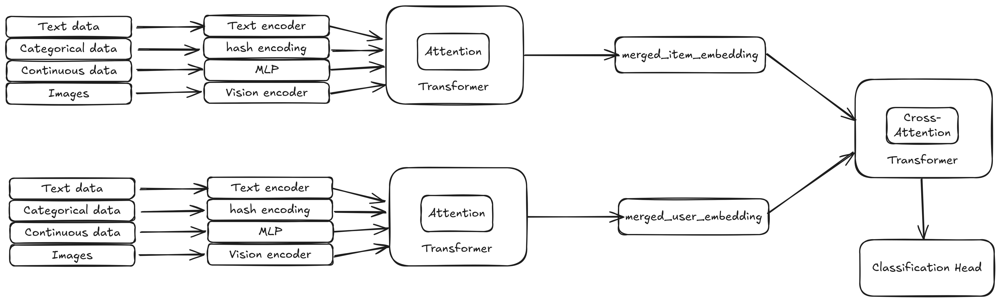

<div align="center">
  
  
  # RecommendKit - Universal Recommendation System Framework
  
  A ready-to-use, out-of-the-box library for training scalable recommendation systems. Built for accessibility and extensibility, this system can be adapted to any use case with minimal configuration.
</div>

## ✨ Key Features

- **🎯 Universal**: Works with any recommendation use case - e-commerce, content, social media, etc.
- **📈 Highly Scalable**: Designed to handle datasets from thousands to millions of interactions
- **🔧 Accessible**: Simple JSON configuration - no complex setup required
- **🚀 Extensible**: Modular architecture allows easy customization and feature expansion
- **⚡ Production Ready**: Includes training, inference, and model persistence out of the box

## 📁 Project Structure

```
recommendkit/
├── configs/                          # Configuration files
│   ├── correlated_dataset_config.json           # SimpleFusion config
│   └── correlated_dataset_attention_config.json # Attention-based config
├── datasets/
│   └── synthetic/                    # Synthetic dataset generation
│       ├── generate_correlated_dataset.py       # Dataset generator script
│       └── correlated_dataset.json              # Generated dataset
├── encoders/                         # Feature encoders (text, image, categorical, etc.)
├── interaction/                      # Feature fusion and interaction modeling
├── classifier/                       # Classification heads and loss functions
├── trainer/                          # Training pipeline and data loading
├── train.py                          # Main training script
├── inference.py                      # Inference script
└── quickstart.ipynb                  # Interactive quickstart notebook
```

## 📊 Simple Data Format

The system uses an intuitive JSON format that supports multiple feature types:

```json
{
  "user_data": [
    {
      "user_id": 1,
      "image": {"profile_pic": "/path/to/image.jpg"},
      "text": {"bio": "User description", "summary": "Short summary"},
      "categorical": {"country": "USA", "gender": "male"},
      "continuous": {"age": 25.0, "income": 50000.0},
      "temporal": {"prev_interactions": [1, 2, 3], "session_times": [5, 10, 15]}
    }
  ],
  "item_data": [
    {
      "item_id": 101,
      "image": {"main_image": "/path/to/item.jpg"},
      "text": {"title": "Product Name", "description": "Product description"},
      "categorical": {"category": "electronics", "brand": "BrandName"},
      "continuous": {"price": 99.99, "rating": 4.5},
      "temporal": {"price_history": [99.99, 89.99], "view_counts": [10, 20, 30]}
    }
  ],
  "interactions": [
    {"user_id": 1, "item_id": 101, "interaction_type": "purchase", "timestamp": "2024-01-15T10:30:00"}
  ]
}
```

### 🎯 Automatic Sample Generation

The system automatically handles positive and negative sample generation:

- **Positive Samples**: Extracted from your interaction data (purchases, clicks, views, etc.)
- **Negative Samples**: Intelligently generated using random sampling from non-interacted items
- **Balanced Training**: Configurable positive/negative ratios for optimal model performance
- **No Data Leakage**: Ensures users don't see items they've already interacted with in negative samples

## 🚀 Quick Start

### 📓 Interactive Quickstart Notebook (Recommended for Beginners)

The easiest way to get started is with our interactive Jupyter notebook that walks you through the entire process:

```bash
jupyter notebook quickstart.ipynb
```

The notebook covers:
- **Data Loading**: Load and explore user and item features with sample data points
- **Configuration**: Understand SimpleFusion config parameters
- **Model Training**: Train a recommendation model step-by-step
- **Inference**: Generate personalized recommendations directly in the notebook

Perfect for learning how RecommendKit works! 🎓

### Generate Synthetic Dataset (Optional)

If you want to test the system with synthetic data, generate a correlated dataset:

```bash
cd datasets/synthetic
python3 generate_correlated_dataset.py --num_users 1000 --num_items 100 --output correlated_dataset.json
```

This creates a realistic dataset with:
- **1000 users** with diverse occupations, locations, ages, and salaries
- **100+ items** across multiple categories (tech, medical, kitchen, etc.)
- **Perfect correlations** between user attributes and item preferences (e.g., software engineers prefer tech items, chefs prefer kitchen items)
- **Temporal interaction history** for each user

### Training with Default Configuration

```bash
python3 train.py --config configs/correlated_dataset_config.json --data datasets/synthetic/correlated_dataset.json
```

This command will:
- Load your data and configuration
- Automatically generate positive/negative samples
- Train the recommendation model
- Save the trained model for inference

### Running Inference

```bash
python3 inference.py --model_path models/your_trained_model.pth --config configs/correlated_dataset_config.json --data test_input.json
```

The inference script provides:
- **User Embeddings**: Generate vector representations for users
- **Item Embeddings**: Generate vector representations for items  
- **Similarity Scores**: Calculate user-item compatibility scores
- **Top-K Recommendations**: Get ranked item recommendations for users

## 🏗️ Architecture

Built with **flexible two-tower fusion architecture** that adapts to your needs:



The system uses a **two-tower architecture** where user and item features are processed independently through their respective towers, then combined for interaction modeling and final classification.

### **SimpleFusion (Default)**
- **Optimized for Speed**: Concatenation + MLP approach for fast training and inference
- **Stable Training**: No transformer collapse issues, clean gradients
- **Small Feature Sets**: Perfect for 2-4 features per entity
- **Production Ready**: Minimal computational overhead

### **Attention-Based Fusion (Advanced)**
- **Complex Interactions**: Transformer-based feature fusion for rich feature sets
- **Scalable**: Handles dozens of features with learned attention weights
- **Flexible**: Adaptive feature importance based on context

### **Easy Architecture Switching**
Switch between fusion methods directly in your config file - no code changes needed!

**SimpleFusion Configuration:**

```json
{
  "user_use_simple_fusion": true,
  "item_use_simple_fusion": true,
  "interaction_use_simple_fusion": true
}
```

**Attention-Based Fusion Configuration:**

```json
{
  "user_use_simple_fusion": false,
  "user_num_attention_layers": 2,
  "user_num_heads": 8,
  "user_dropout": 0.1,
  "user_use_cls_token": true,
  
  "item_use_simple_fusion": false,
  "item_num_attention_layers": 2,
  "item_num_heads": 8,
  "item_dropout": 0.1,
  
  "interaction_use_simple_fusion": false,
  "interaction_num_attention_layers": 2,
  "interaction_num_heads": 8,
  "interaction_dropout": 0.1
}
```

See `configs/correlated_dataset_config.json` (SimpleFusion) and `configs/correlated_dataset_attention_config.json` (Attention) for complete examples!

## 🔧 Customization

The system is designed for maximum extensibility:

### **Bring Your Own Encoders**
Plug-and-play architecture for custom feature encoders:

```python
# Create custom encoder
class MyCustomEncoder(nn.Module):
    def __init__(self, input_dim, output_dim):
        super().__init__()
        self.encoder = nn.Linear(input_dim, output_dim)
    
    def forward(self, x):
        return self.encoder(x)

# Drop into pipeline
pipeline.add_encoder('my_feature_type', MyCustomEncoder(128, 64))
```

### **Modular Components**
- **Feature Encoders**: `encoders/` - Add support for new data types (audio, video, graphs, etc.)
- **Fusion Layers**: `interaction/feature_fusion.py` - Custom feature combination strategies  
- **Interaction Models**: `interaction/interaction_modeling.py` - User-item interaction architectures
- **Classification Heads**: `classifier/` - Custom loss functions and output layers

### **Easy Integration**
- **Standard Interfaces**: All components follow consistent input/output contracts
- **Auto-Discovery**: New encoders are automatically detected and integrated
- **Config-Driven**: Add new components without touching core training code
- **Backward Compatible**: Extensions don't break existing functionality

### **Advanced Customizations**
- **Custom Loss Functions**: Implement ranking losses, contrastive learning, etc.
- **Multi-Task Learning**: Add auxiliary prediction tasks
- **Domain-Specific Features**: Industry-specific encoders (NLP, computer vision, time series)
- **Distributed Training**: Scale across multiple GPUs and nodes

## 📈 Scalability

Designed to grow with your needs:
- **Memory Efficient**: Optimized data loading and batch processing
- **GPU Accelerated**: Full CUDA support for faster training
- **Distributed Ready**: Architecture supports multi-GPU and distributed training
- **Production Deployment**: Easy integration with serving frameworks

---

**Ready to build your recommendation system?** Start with SimpleFusion for quick results, then scale to attention-based fusion as your feature complexity grows! 🎯
